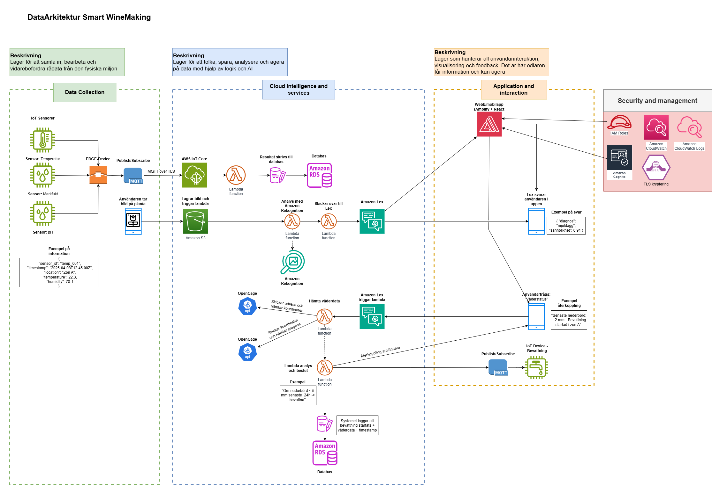

# 🍇 Smart WineMaking – AI & IoT för vinodling

Detta projekt är en del av YH-utbildningen *AI och IoT* (BK24TR) och syftar till att förbättra vinodling genom smart teknik. Genom att kombinera artificiell intelligens, IoT-sensorer och molntjänster kan vinodlare fatta mer informerade beslut om sjukdomsbekämpning, bevattning och skörd.

## 🌟 Mål

- ✔️ Tidig upptäckt av sjukdomar med bildigenkänning (Amazon Rekognition)
- ✔️ Optimerad bevattning och resurshantering via IoT-sensorer
- ✔️ Förbättrad druvkvalitet och stabil avkastning
- ✔️ Minskad miljöpåverkan

## 🧠 Huvudkomponenter

### 📷 AI-analys av grödor
- **Amazon Rekognition Custom Labels**
- Bilder laddas upp till S3 → Triggers via Lambda → Analysresultat lagras i DynamoDB

### 📡 IoT-infrastruktur
- **Sensorer**: markfuktighet, temperatur, luftfuktighet, ljus
- **AWS IoT Core** hanterar datainsamling i realtid
- **Kommunikation**: Wi-Fi / 4G / 5G / LoRa

### ☁️ Molntjänster och datahantering
- **S3** för bildlagring
- **DynamoDB** / **RDS** för strukturerad data
- **Amazon Quicksight** för datavisualisering och analys

### 🤖 Chatbot & användargränssnitt
- **Amazon Lex** – användaren kan prata/texta med AI:n för väder, fukt, och rekommendationer
- **AWS Lambda** – hanterar API-anrop (t.ex. SMHI, OpenCage)
- **Frontend**: React + AWS Amplify / mobilapp

## 🛰️ Externa API:er
- **SMHI** – väderdata baserat på plats
- **OpenCage** – geokodning av platsnamn till koordinater

## 🏗️ Data Arkitektur

Dataarkitekturen för det här projektet använder tre olika lager **Data Collection**, **Cloud Intelligence and services**, and **Application and interaction**:

## 🗓️ Tidsplan (sammandrag)

| Månad | Aktivitet |
|-------|-----------|
| 0–1   | Förstudie, kravinsamling, teknikval |
| 1–2   | Teknisk setup, molntjänster, sensorintegration |
| 2–4   | Bildinsamling & AI-träning (mjöldagg) |
| 4–6   | Chatbot, SMHI-integration, prototyp |
| 6–8   | Testning, feedback, förbättringar |
| 8–10  | Lansering, utökning av funktioner |
| 10–12 | Effektmätning, drönardata, vidare utveckling |

## 🛡️ Säkerhet och integritet
- 🔐 Kryptering av data
- 🔐 Åtkomstkontroll via IAM
- ✅ GDPR-efterlevnad

## ⚠️ Utmaningar
- Kvalitetsdata för AI-träning
- Användarnas tillit till AI
- Internetberoende i fält
- Hårdvarans tålighet för väder

## 🧪 Feedback & iteration
- Beta-testning med vinodlare
- Workshops & uppföljningar
- Inbyggd feedback-funktion i appen
- Agil utveckling: nya funktioner släpps kontinuerligt

## 🔍 Exempel på användning
> "Risk för mögel i sektion B – hög luftfuktighet och temperatur kombinerat med regnprognos. Rekommenderad åtgärd: besprutning inom 24h."

---

---

> 👨‍💻 Projektet har genomförts av Agne Dimaisate, Therese Andersson, Daniel Karlsson och Axel Gummesson (BK24TR)
